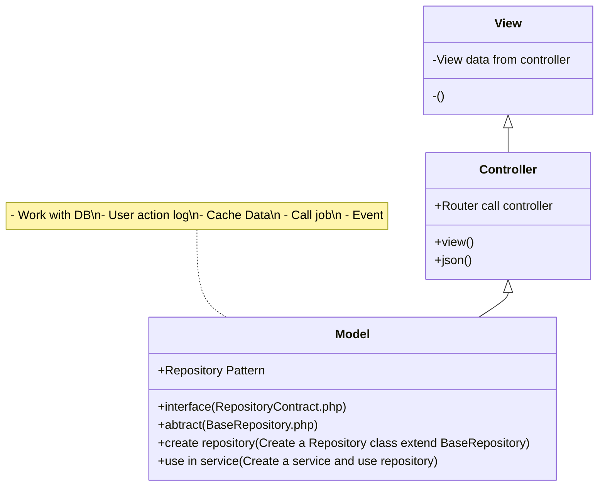

# Level 1/5. Beginner Level

## 🌀 Logos
- **laravel version:** <code>11</code> 
- **Bootstrap version:** <code>5</code> 
- **PHP:** <code>8.3</code> 
- **MySQL:** <code>8.4</code> 
- **Docker:** <code>https://github.com/hogibpro98/docker-compose-template</code> 

## 🚀 Quickstart
- Step 1: Clone <code>https://github.com/hogibpro98/docker-compose-template</code> 
- Step 2: Change .env to true config

## ⭐ Features
Goal: to create your very first simple Laravel project.

<table>
 <tr valign="top" style="vertical-align:top">
  <td>
   <strong>	Routing and Controllers: Basics</strong> 

⭐:<code>Callback Functions and Route::view()</code>

1. What: cách đặt tên cho các đường dẫn
2. Where: <code>web.php</code> | <code>api.php</code>
3. How to: use method <code>name</code> Ex: Route::get('/home', [HomeController::class, 'index'])->name('home');
4. Why: ngắn gọn, rễ nhớ, thuận tiện sử dụng
5. When: Khi bạn biết rằng đường dẫn này sẽ được sử dụng ở nhiều nơi

 

   ⭐: <code>Routing to a Single Controller Method</code> 
   ⭐: <code>Route Parameters</code> 

⭐:<code>Route Naming</code>

1. What: cách đặt tên cho các đường dẫn
2. Where: <code>web.php</code> | <code>api.php</code>
3. How to: use method <code>name</code> Ex: Route::get('/home', [HomeController::class, 'index'])->name('home');
4. Why: ngắn gọn, rễ nhớ, thuận tiện sử dụng
5. When: Khi bạn biết rằng đường dẫn này sẽ được sử dụng ở nhiều nơi

   ⭐: <code>Route Groups</code> 
  </td>
  <td>
   <strong>Blade Basics</strong> 
   ⭐: <code>Displaying Variables in Blade</code> 
   ⭐: <code>Blade If-Else and Loop Structures</code> 
   ⭐: <code>Layout: @include, @extends, @section, @yield</code> 
   ⭐: <code>Blade Components</code> 
  </td>
  <td>
   <strong>Auth Basics</strong> 
   ⭐: <code>Starter Kits: Breeze (Tailwind) or Laravel UI (Bootstrap)</code> 
   ⭐: <code>Default Auth Model and Access its Fields from Anywhere</code> 
   ⭐: <code>Check Auth in Controller / Blade</code> 
   ⭐: <code>Auth Middleware</code> 
  </td>
  <td>
   <strong>Database Basics</strong> 
   ⭐: <code>Database Migrations</code> 
   ⭐: <code>Basic Eloquent Model and MVC: Controller -> Model -> View</code> 
   ⭐: <code>Eloquent Relationships: belongsTo / hasMany / belongsToMany</code> 
   ⭐: <code>Eager Loading and N+1 Query Problem</code> 
  </td>
 </tr>
 <tr valign="top" style="vertical-align:top">
  <td>
   <strong>Full Simple CRUD</strong> 
   ⭐: <code>Route Resource and Resourceful Controllers</code> 
   ⭐: <code>Forms, Validation and Form Requests</code> 
   ⭐: <code>File Uploads and Storage Folder Basics</code> 
   ⭐: <code>Table Pagination</code> 
  </td>
 </tr>
</table>

## 💡 Structure:

